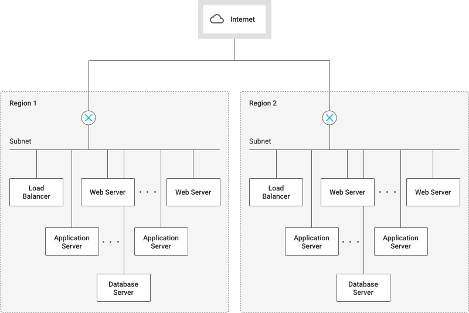

# Platform overview

## Table of contents
{: .no_toc .text-delta }

1. TOC
{:toc}

This article is designed to equip people with the key concepts to get started with OpenStack, whether you’re considering migrating or implementing a new deployment.

### Cloud computing services

Cloud computing services provide a set of baseline services, which include compute, storage, networking, access management, and often database services.

OpenStack’s baseline services include:

- Compute: OpenStack Compute (Nova and Glance)
- Storage: OpenStack Block Storage (Cinder)
- Networking: OpenStack Networking (Neutron)
- Identity and access management: OpenStack Identity Service (Keystone)

### Sample architecture

This section describes how you might build a 3-tier web application system on OpenStack.

A typical 3-tier web application consists of the following components:

- Load balancer
- Web server
- Application server
- Database server

The sample OpenStack configuration shown in figure 1 has the following characteristics:

- You deploy resources across two regions as two separate failure domains for redundancy.
- The network uses a single subnet for all tiers in each region, and all servers are virtual machine (VM) instances.
- You define security groups for the four server roles and assign them to the appropriate instances.
- A Cinder volume is attached to the database server as a data volume. To ensure redundancy across failure domains, the database in the active region is backed up to object storage and restored to the one in the backup region when necessary. (This architecture does not use real-time database replication, because bandwidth is limited between regions.)
- This architecture provides an active-backup configuration. When you failover the service to another region, you restore the most recent backup to the database server in the backup region.

